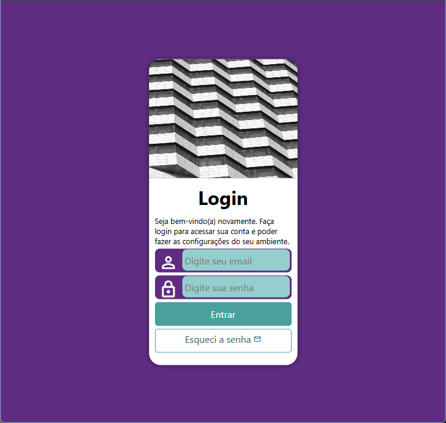
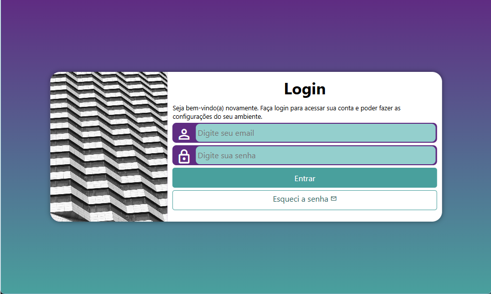
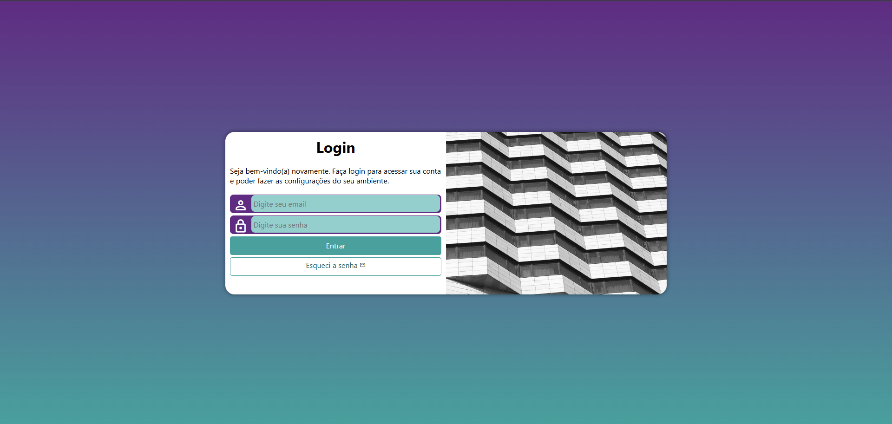

# 🔐 Projeto Login

Este é um projeto de tela de login desenvolvido com HTML e CSS, com foco em layout moderno, responsividade e boas práticas de front-end.

## 🚀 Acesse o projeto

👉 https://erasmo-jr.github.io/projeto-login/

## 💻 Tecnologias utilizadas

* HTML5
* CSS3

## 🎯 Objetivo

O objetivo deste projeto foi praticar a criação de interfaces de login, trabalhando principalmente:

* Estruturação com HTML
* Estilização com CSS
* Responsividade para diferentes dispositivos

## 📱 Responsividade

O layout foi desenvolvido para funcionar bem em diferentes dispositivos:

### 📱 Smartphone

### 📲 Tablet

### 💻 Desktop

## 🧠 Aprendizados

Durante o desenvolvimento deste projeto, pratiquei:

* Organização de layout
* Uso de media queries
* Estilização de formulários
* Responsividade

## 📌 Observação

Este projeto é apenas visual (front-end), não possui integração com back-end ou autenticação real.

## 📈 Evolução

Este projeto faz parte da minha evolução como desenvolvedor. Futuramente, pretendo criar versões mais completas com:

* JavaScript
* Validação de formulário
* Integração com back-end

## 👨‍💻 Autor

Desenvolvido por Erasmo Junior
